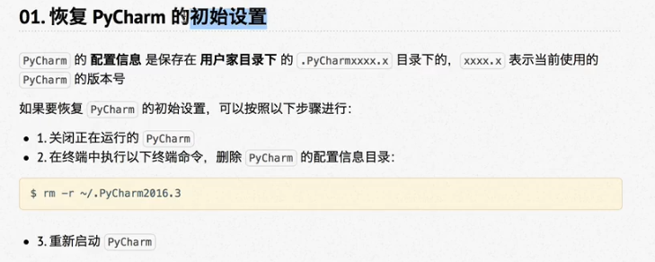
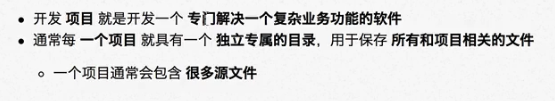
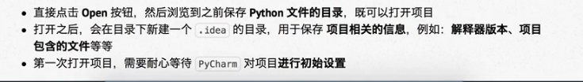
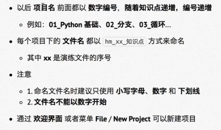

# python（蟒蛇）

##### 1.1解释器

编译器：将其他语言翻译成机器语言的工具。

编译器翻译的方式分两种：一种是编译，一种是解释。编译翻译对源代码进行一次性翻译，而后生成最终执行文件，该文件不可跨平台使用，文件运行效率高；解释翻译为逐行翻译，边翻译边执行，可在不同的平台上进行翻译，翻译效率低。

python设计哲学：优雅、简单、明确。

##### 1.2对人生苦短，我用python的理解：

代码量少，开发速度快，节省时间做其他的事情。 

##### 1.3python特点：找一个有这个能力的对象来解决相应的问题

**python完全面向对象**，函数、模块，数字、字符串等等都是对象；完全支持继承、重载、多重继承；既支持重载运算符，又支持泛型设计。

**python拥有一个强大的标准库**，python语言核心的只包含数字、字符串、列表、字典、文件等常见的类型和函数，标准库提供了系统管理、网络通信、文本处理、数据库接口、图形系统、XML处理等额外的功能。

python社区提供了大量的第三方模块（由爱好者等开发的库），使用方式与标准库类似。他们的功能覆盖科学计算、人工智能、机器学习、Web开发、数据库接口、图形系统多个领域。

##### 面向对象的思维方式

面向对象 ，是一种思维方式，也是一们程序设计技术

要解决一个问题之前，首先要考虑由谁来做，怎么做是谁的职责，最后把事情做好进行！对象就是谁。

要解决复杂的问题，就可以找多个不同的对象，各司其职，共同实现，最终完成需求。

#####  2.1python的优点

简单易学，免费开源，面向对象，丰富的库，扩展性强

如果需要一段关键代码运行的更快或者希望某些算法不公开，可以把这部分程序用C或C++编写，然后在python中运行使用。


## 第一个python程序

执行python程序的三种方式

解释器——python/python3

交互式——ipython

集成开发环境——PyCharm

### 01.第一个HelloPython程序

#### 1.1Python源程序的基本概念

1.python源程序是一个特殊格式的文本文件，可以使用任意文本编辑软件做python开发

2.python程序的文件扩展名通常是.py

#### 1.2演练步骤

函数：print（“需要显示的内容”），作用：把“”内部的内容，输出到屏幕上

为了不忘记，可以先把公式括号引号先弄完

在终端中输入python调用语言解释器

#### 1.3演练扩展——认识错误（bug）

##### 关于错误

程序不能正常执行，结果不是预定结果

俗称bug，常见原因有：1.手误 2.已经学过的知识理解还存在不足 3.对语言还有需要学习和提升的内容

学习语言时，要学习语言的语法，还要学会认识错误和解决错误的方法

##### 1）手误

```
NameError：name 'priot' is not defined
名称错误：‘priot’名字没有定义
```

##### 2）将多余的命令写在同一行

```
SyntaxEror: invalid syntax
语法错误：语法无效
```

每行代码负责一个动作

##### 3）缩进错误

```
IndentationError: unexpected indent
缩进错误：不期望出现的缩进
```

python——格式非常严格的程序设计语言

每行代码前面都**不要增加空格**，否则会出现缩进错误

##### 4）python 2.x默认不支持中文

python目前有两个版本，分别是2.x和3.x

python 2.x的解释器名称是python

python 3.x的解释器名称是python3

```
SyntaxEror: Non-ASCII character '\xe4' in file python文件名 on 报错位置，
but no encoding declared;
see http://python.org/dev/peps/pep-0263/ 了解信息

语法错误：在 python文件名 中 报错位置 出现了非ASCII字符 '\xe4'，但是没有声明文件编码信息
请访问 http://python.org/dev/peps/pep-0263/ 了解信息
```

ASCII字符只包含256个字符，不支持中文

### 02.执行Python的三种方式

#### 2.1解释器

Python的解释器：Python/Python3

**其它解释器**：

CPython——官方版本的C语言解释器

Jython——可以运行在Java平台

IronPython——可以运行在.NET和Mono平台

PyPy——Python实现的，支持JIT即时编译

#### 2.2交互式运行Python程序

##### 1）交互式运行Python

##### 2）退出 官方的解释器

1.直接输入exit()

```
>>>exit()
```

2.使用热键退出

在python解释器中，热键CTRL+d退出解释器

##### 3）IPython

IPython中“I”代表交互（interactive）

###### 特点

1.支持自动补全

2.自动缩进

3.支持bash shell命令（Linux命令）

4.内置很多功能和函数

IPython是基于BSD开源的

启动时命令前面增加字母i

退出时可直接输入exit

#### 2.3.Python的IDE——PyChrm

##### 1）集成开发环境（IDE）

集成了开发软件所需要的所有工具，一般有：图形用户界面、代码编辑器（支持 代码补全、自动缩进）、编译器/解释器、调试器（断点/单步执行）

##### 2）PyChrm

适合开发大型项目：包含很多源文件，每个源文件代码行数有限，代码之间各司其职，共同完成复杂的业务。

#### 2.4.PyCharm的初始设置



##### 02.新建/打开项目

1.项目简介



2.打开项目



3.命名规则



