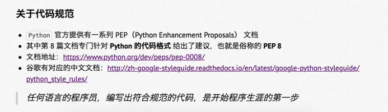

# 注释

## 01.注释的作用

增强可读性

## 02.单行注释（行注释）

以 # 开头，后边添加注释，进行辅助性说明

```
# 这是第一行注释
print("显示内容")
```

为了保证代码的可读性，#后边要添加空格，然后在编写注释进行说明

### 在代码后面增加的单行注释

在代码后面增加注释时，同样用#进行隔断

注释和代码之间至少要有两个空格

```
print("显示内容")  # 输出“显示内容”
```

## 03.多行注释（块注释）

注释信息很多，一行无法显示时，可以使用多行注释

使用多行注释，可以用**一对 连续的 三个 引号**（单引号和双引号都可以）

```
"""
这是一个多行注释

在注释之间，能写很多行内容......
"""
print("显示内容")
```

### 注释使用注意

1.**注释不是越多越好**，能看懂的代码不用添加注释

2.对于 **复杂的操作**，应该在操作开始前协商若干行注释

3.对于 **不是一目了然的代码**，应该在其行尾添加注释（为了提高可读性，注释应该至少离开代码2个空格）

4.绝对不要描述代码，比你更懂的人只是不知道你想用代码干啥

在正规的开发团队中，**一般会有** 代码审核 的惯例，就是团队中彼此阅读对方的代码


