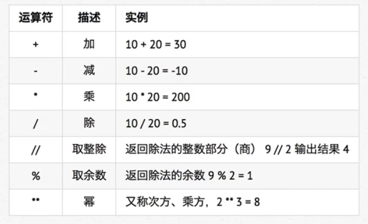

# 算数运算符

计算机：负责进行 **算数计算** 并且 **存储计算结果** 的电子设备

## 01.算数运算符

算数运算符是 **运算符的一种**

是完成基本的算数运算使用的符号，用来处理四则运算



 字符串："*"，引号中间的内容为字符串

在python中，*运算符还可以用于字符串，计算结果就是字符串重复指定次数的结果

```
In [1]: "1" * 10
Out[1]: '1111111111'
```

## 02.算数运算的优先级

- 与数学中的运算符优先级一致
  - 可以使用（）调整计算的优先级
- 以下表格的算数优先级由高到低顺序排列

| 运算符 | 描述                   |
| ------ | ---------------------- |
| **     | 幂（最高优先级）       |
| */%//  | 乘、除、取余数、取整数 |
| +-     | 加、减法               |

