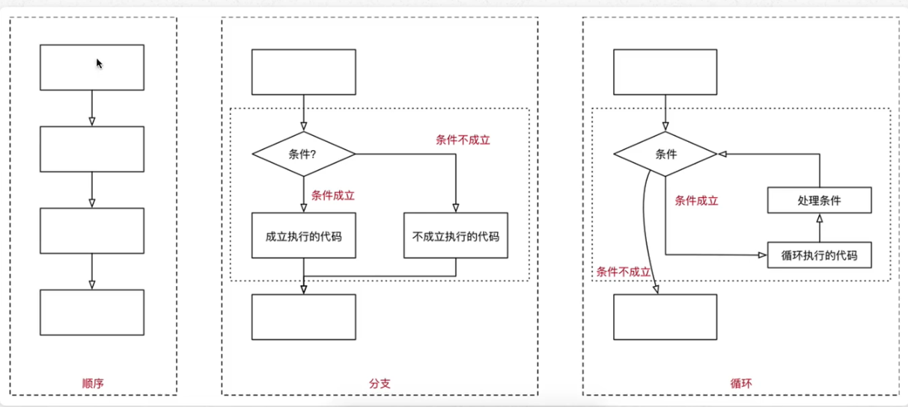

# 循环

## 01.程序的三大流程

- 在程序开发中，一共有三种流程方式：
  - **顺序**——**从上向下**，顺序执行代码
  - **分支**——根据条件判断，决定执行代码的 **分支**
  - **循环**——让 **特定代码 重复** 执行



## 02.while 循环基本使用

- 循环的作用就是让 **指定的代码** 重复的执行
- while 的常用场景是 **让执行的代码** 按照 **指定的次数 重复** 执行

### 2.1 while 语句基本语法

```
初始条件 —— 通常是重复执行的 计数器

while 条件(判断 计数器 是否达到 目标次数):
	满足条件时,做的事情1
	满足条件时,做的事情2
	……
	
	处理条件(计数器 + 1)
```

##### **注意:**

- while 语句以及缩进部分是一个 **完整的代码块**
- 循环结束后,之前定义的计数器条件的数值是依旧存在的

死循环

**忘记** 在循环内部 **修改循环的判断条件**,导致循环持续执行,程序无法终止!!!

### 2.2 赋值运算符

- 在python中,使用 = 可以给变量赋值
- 在算数运算时,python提供有一系列的与 **算数运算符** 对应的 **赋值运算符** ,用于简化代码的编写
- 注意: **赋值运算符中间不能使用空格**

| 运算符 | 描述                       | 实例                                  |
| :----: | -------------------------- | ------------------------------------- |
|   =    | 简单的赋值运算符           | c = a + b 将 a + b 的运算结果赋值为 c |
|   +=   | 加法赋值运算符             | c += a 等效于 c = c + a               |
|   -=   | 减法赋值运算符             | c -= a 等效于 c = c - a               |
|   *=   | 乘法赋值运算符             | c *= a 等效于 c = c * a               |
|   /=   | 除法赋值运算符             | c /= a 等效于 c = c / a               |
|  //=   | 取整除赋值运算符           | c //= a 等效于 c = c // a             |
|   %=   | 取 **模** (余数)赋值运算符 | c %= a 等效于 c = c % a               |
|  **=   | 幂赋值运算符               | c **= a 等效于 c = c ** a             |

### 2.3 Python 中的计数方法

常见的计数方法：

- **自然计数法**（从 1 开始）——更符合人类的习惯
- **程序计数法**（从 0 开始）——几乎所有的程序的程序语言都是**从 0 开始技技术**

**除非特殊需求，否则 循环 的计数都从 0 开始**

### 2.4 循环计数

对于 **利用循环 重复计算** 的需求，可以：

1. 在 while 上方定义一个变量，用于 **存放最终计算结果**
2. 在循环体内部，每次循环都用 **最新的计算结果，更新** 之前定义的变量

## 03.break 和continue

break 和 continue 是专门在循环中使用的关键字

- **break** **某一条件满足时**，退出循环不再执行后续重复的代码（大条件下满足小条件直接跳出去）
- **continue** **某一条件满足时**，不执行后续重复的代码（排除某一特定的条件）

break 和 continue 只针对 **当前所在循环** 有效

**注意** 

- 在循环中，使用 continue 关键字，使用之前，需要确认循环的计数是否修改，以防止死循环的产生
- continue 只针对当前所在的循环有效

## 04.while 循环嵌套

### 4.1循环嵌套

### 4.2循环嵌套演练——九九乘法表

第 1 步：用嵌套打印小星星

第 2 步：使用循环嵌套打印小星星

**划重点** 对 print 函数的使用进行强化

- 在默认情况下， print 函数输出内容后之后，会自动在内容末尾增加换行

- 如果不要在末尾增加换行，可以在 print 函数输出内容的后面增加 end=""

- 其中 "" 中间可以指定 print 函数输出内容之后，继续显示的内容

- 语法格式如下：

  ```
  # 向控制台输出内容结束后，不会换行
  print("*", end="")
  
  # 单纯的换行
  print("*")
  ```

  end="" 表示向控制台输出内容结束之后，不会换行

第 3 步：九九乘法表

**字符串中的转义字符**.

- \t 在控制台输出一个 **制表符**，协助在输出文本时 **垂直方向** 保持对齐
- \n 在控制台输出一个 **换行符**

**制表符** 方法功能是在不使用表格的情况下在 **垂直方向** 按列对齐文本

| 转义字符 |    描述    |
| :------: | :--------: |
|   \\\\   | 反斜杠符号 |
|   \\'    |   单引号   |
|   \\"    |   双引号   |
|   \\n    |    换行    |
|   \\t    | 横向制表符 |
|   \\r    |    回车    |

